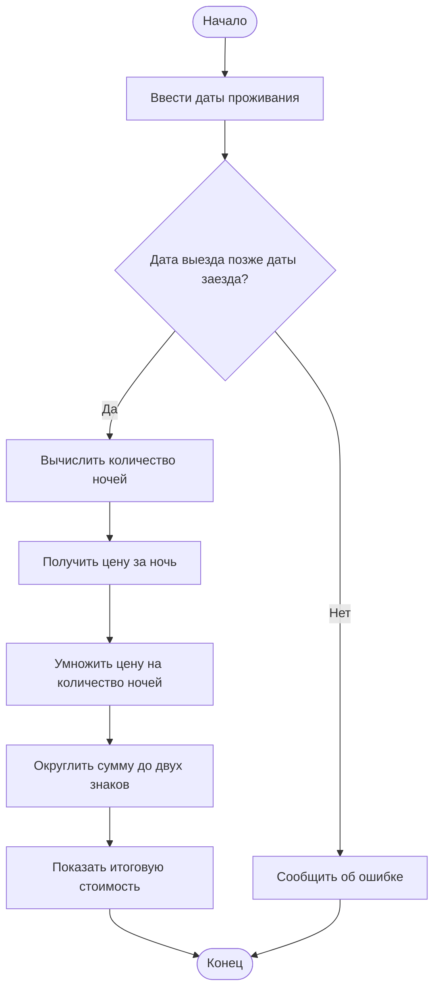

# Блок-схема: расчёт стоимости

```mermaid
flowchart TD
    A([Начало]) --> B[Ввести даты проживания]
    B --> C{Дата выезда позже даты заезда?}
    C -->|Нет| D[Сообщить об ошибке]
    C -->|Да| E[Вычислить количество ночей]
    E --> F[Получить цену за ночь]
    F --> G[Умножить цену на количество ночей]
    G --> H[Округлить сумму до двух знаков]
    H --> I[Показать итоговую стоимость]
    I --> J([Конец])
    D --> J
```
