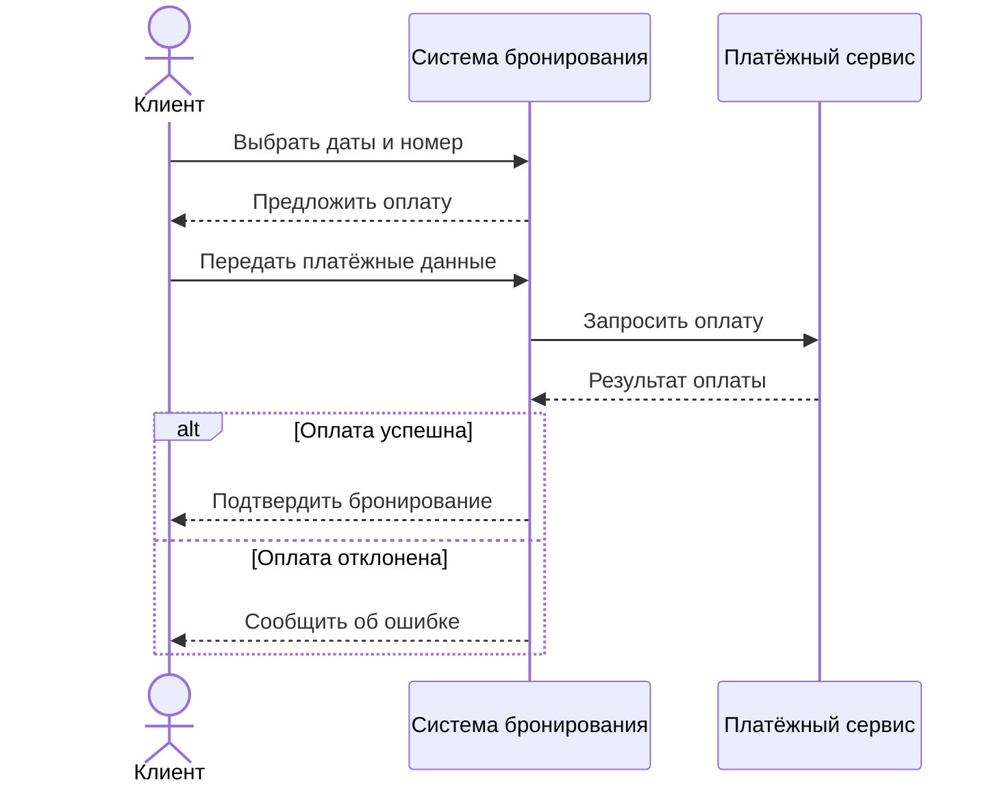

# Диаграмма последовательности: оплата

```mermaid
sequenceDiagram
    actor C as Клиент
    participant S as Система бронирования
    participant P as Платёжный сервис
    C->>S: Выбрать даты и номер
    S-->>C: Предложить оплату
    C->>S: Передать платёжные данные
    S->>P: Запросить оплату
    P-->>S: Результат оплаты
    alt Оплата успешна
        S-->>C: Подтвердить бронирование
    else Оплата отклонена
        S-->>C: Сообщить об ошибке
    end
```
